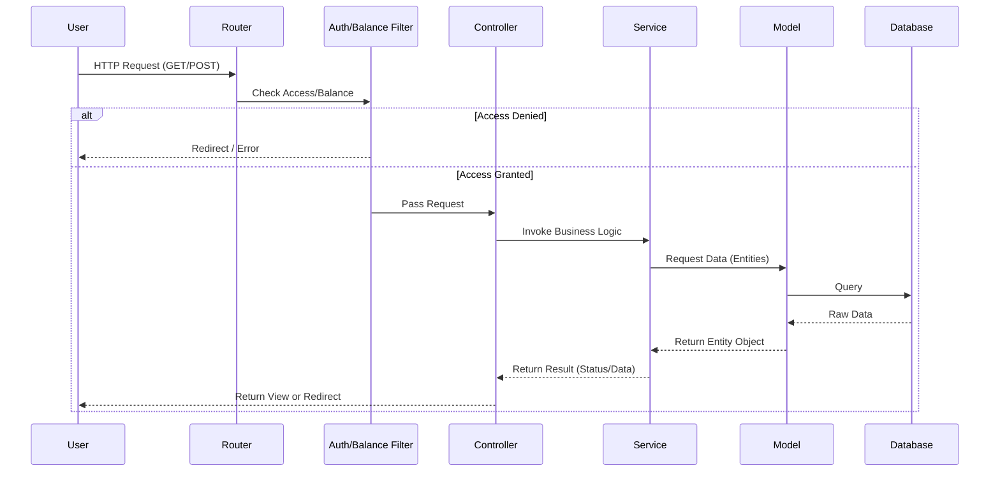

# PROJECT DOCUMENTATION: GENAI WEB PLATFORM

## Table of Contents

---

**Part I: Getting Started**

**1. Introduction**
1.1. What is GenAI Web Platform?
1.2. Core Features & Capabilities
1.3. Who Is This For?
1.4. Technology Stack

**2. Quick Start Guide**
2.1. Your First 5 Minutes
2.2. Running the Application Locally
2.3. Key Concepts at a Glance

**3. Installation**
3.1. Server Requirements & Prerequisites
3.2. Automated Installation (Recommended)
3.3. Manual Installation (Advanced)
3.4. Environment Configuration (`.env`)
3.5. Post-Installation Steps & Security

---

**Part II: Guides & Tutorials**

**4. Core Concepts**
4.1. Architectural Overview (Modular MVC-S)
4.2. The Request Lifecycle
4.3. Service Container & Dependency Injection
4.4. Directory Structure Explained
4.5. Security Principles
4.6. Frontend Design (The 'Blueprint' Method)

**5. Tutorial: Building Your First Feature**
5.1. Creating a New Route
5.2. Building the Controller & Service
5.3. Interacting with the Database (Model & Entity)
5.4. Displaying Data in a View

**6. Feature Guides (Deep Dives)**
6.1. User Authentication
6.1.1. Registration & Login Flow
6.1.2. Email Verification & Password Resets
6.1.3. Access Control with Filters
6.2. Payment Gateway Integration
6.2.1. Configuration
6.2.2. Initiating a Transaction
6.2.3. Verifying a Payment
6.3. AI Service Integration
6.3.1. Generative Text & Multimodal Input
6.3.2. Hybrid Memory System (Vector + Keyword)
6.3.3. Text-to-Speech (TTS) & Audio Processing
6.3.4. Advanced Document Generation (Pandoc/XeTeX)
6.3.5. User Settings (Voice & Assistant Modes)
6.4. Cryptocurrency Data Service
6.4.1. Querying Balances
6.4.2. Fetching Transaction Histories
6.5. Administrative Dashboard
6.5.1. User Management
6.5.2. Sending Email Campaigns
6.5.3. Viewing Application Logs
6.6. Blog & Content Management
6.6.1. Public-Facing Blog
6.6.2. Admin Management Interface
6.7. Self-Hosted Documentation
6.7.1. Serving Documentation Pages

---

**Part III: Technical Reference**

**7. Command-Line Interface (CLI)**
7.1. Overview of Custom Commands
7.2. `php spark train`
7.3. `php spark db:backup`
7.4. `php spark db:restore`
7.5. `php spark make:module`

**8. Configuration Reference**
8.1. Application (`App.php`)
8.2. Database (`Database.php`)
8.3. Custom Configurations (`AGI.php`, `Recaptcha.php`)

**9. Testing**
9.1. Running the Test Suite
9.2. Writing Unit Tests
9.3. Writing Feature Tests

---

**Part IV: Operations & Community**

**10. Deployment**
10.1. Production Server Setup
10.2. Deployment Checklist
10.3. Performance Optimization

**11. Troubleshooting**
11.1. Frequently Asked Questions (FAQ)
11.2. Common Error Resolutions
11.3. Logging & Debugging

**12. Contributing**
12.1. Contribution Guidelines
12.2. Code Style (PSR-12)
12.3. Submitting a Pull Request

**13. Appendices**
13.1. Glossary of Terms
13.2. Changelog & Release History

---

**Part V: Documentation Maintenance Guide**

**15. A Guide for the Project Owner**
15.1. The Philosophy of Living Documentation
15.2. Your Role vs. the AI's Role
15.3. The Documentation Update Workflow
15.4. Procedure: How to Review the Codebase for Changes
15.5. Procedure: Updating the Changelog and Managing Releases

---

**Part I: Getting Started**

**1. Introduction**

**1.1. What is GenAI Web Platform?**

The GenAI Web Platform is a comprehensive, multi-functional application built on the CodeIgniter 4 framework. It is architected using a **Modular MVC-S pattern**, where each distinct business feature (like AI, Payments, or the Blog) is encapsulated in its own self-contained module for maximum maintainability. The platform serves as a portal for registered users to access a suite of powerful digital services, including AI-driven content generation, real-time cryptocurrency data queries, and robust user and content management capabilities. Designed with a modular architecture, it features a secure user authentication system, an account dashboard with an integrated balance and payment system (supporting M-Pesa, Airtel, and Card), a complete administrative panel for user oversight, and a fully integrated blog.

**1.2. Core Features & Capabilities**

- **Modular Architecture:** Core features like AI, Payments, Crypto, and Blog are isolated into self-contained modules for better organization and scalability.
- **User Authentication:** Secure registration, login, email verification, and password reset functionality.
- **Payment Gateway Integration:** Seamless payments via Paystack, a popular African payment gateway.
- **AI Service Integration:** Advanced text and multimedia interaction with Google's Gemini API. Features include a **Hybrid Memory System** (combining Vector embeddings and keyword search), **Text-to-Speech** output, and **Professional Document Generation** (PDF/Word) using LaTeX engines.
- **Advanced Media Generation:** Support for generating high-quality images (Imagen 4.0) and videos (Veo 2.0) directly from text prompts.
- **Local AI Integration (Ollama):** Support for running local LLMs (like Llama 3, DeepSeek) directly on the server, offering privacy-focused AI interactions with zero external API costs.
- **Cryptocurrency Data Service:** Real-time balance and transaction history queries for Bitcoin (BTC) and Litecoin (LTC) addresses.
- **Blog & Content Management:** A public-facing blog with a full administrative backend for creating, editing, and managing posts.
- **Administrative Dashboard:** Robust tools for user management, balance adjustments, financial oversight, log viewing, and sending email campaigns to all users.
- **Self-Hosted Documentation:** The application serves its own documentation, which can be easily updated.
- **Secure & Performant:** Built with modern security best practices and optimized for production environments.

**1.3. Who Is This For?**

This platform is designed for developers, creators, and businesses, particularly in Kenya and the broader African market, who require a flexible, pay-as-you-go solution for accessing advanced AI and blockchain data services. It serves as both a functional application and a robust foundation for building more complex systems.

**1.4. Technology Stack**

- **Backend:** PHP 8.2+, CodeIgniter 4
- **Frontend:** Bootstrap 5, JavaScript, HTML5, CSS3
- **Database:** MySQL 8.0+
- **Web Server:** Apache2
- **Key Libraries:**
  - `google/gemini-php`: For interacting with the Gemini API (supports Gemini 2.5, Imagen 4.0, Veo 2.0).
  - `ollama/ollama`: Local LLM inference server (external dependency).
  - `dompdf/dompdf`: For PDF generation fallback.
  - `nlp-tools/nlp-tools`: For Natural Language Processing (Naive Bayes classification).
  - `php-ffmpeg/php-ffmpeg`: For audio conversion (PCM to MP3).
- **System Dependencies:**
  - **Pandoc & TeX Live (XeTeX):** For high-fidelity PDF/Docx generation.
  - **FFmpeg:** For audio processing.
- **Development & Deployment:** Composer, PHPUnit, Spark CLI, Git, Bash

**2. Quick Start Guide**

**2.1. Your First 5 Minutes**

For a fresh Ubuntu server, the fastest way to get started is with the automated setup script.

1.  Clone the repository: `git clone https://github.com/nehemiaobati/genaiwebapplication.git`
2.  Navigate into the directory: `cd genaiwebapplication`
3.  Make the script executable: `chmod +x setup.sh`
4.  Run with sudo: `sudo ./setup.sh`
5.  **Important:** The installation process may take several minutes as it installs robust PDF engines (TexLive).
6.  After completion, edit the newly created `.env` file to add your `GEMINI_API_KEY`.

**2.2. Running the Application Locally**

1.  **Clone the Repository:** `git clone https://github.com/nehemiaobati/genaiwebapplication.git`
2.  **Install Dependencies:** `composer install`
3.  **Create Environment File:** Copy `env` to `.env` and configure your local database and `app.baseURL`.
4.  **Run Migrations:** `php spark migrate`
5.  **Create Writable Directories:** Ensure `writable/uploads/gemini_temp`, `writable/uploads/ttsaudio_secure`, and `writable/nlp` exist.
6.  **Start the Server:** `php spark serve`
7.  Access the application at `http://localhost:8080`.

**2.3. Key Concepts at a Glance**

- **Modular MVC-S Architecture:** The application is built around self-contained Modules (e.g., `Gemini`, `Payments`).
- **Services:** Core functionality is encapsulated in service classes. For example, `GeminiService` handles API communication, while `FfmpegService` handles audio conversion.
- **Pay-As-You-Go:** Users top up an account balance, and this balance is debited for each AI interaction or Crypto query.

**3. Installation**

**3.1. Server Requirements & Prerequisites**

- **OS:** Ubuntu 20.04/22.04 (Recommended)
- **Web Server:** Apache2
- **PHP:** Version **8.2** or higher. Required extensions: `intl`, `mbstring`, `bcmath`, `curl`, `xml`, `zip`, `gd`, `imagick`.
- **Database:** MySQL Server
- **System Tools:**
  - `ffmpeg`: Required for Text-to-Speech functionality.
  - `pandoc`: Required for document generation.
  - `texlive-xetex`, `texlive-fonts-recommended`, `lmodern`: Required for generating PDFs via Pandoc.

**3.2. Automated Installation (Recommended)**

The `setup.sh` script is designed for a clean Ubuntu server and automates the entire installation process. It will:

- Install Apache2, PHP 8.2, MySQL, FFMpeg, and the full Pandoc/LaTeX stack.
- Create a dedicated database and user.
- Install Composer and Node.js.
- Clone the project repository and install PHP dependencies.
- Create the `.env` file with generated database credentials.
- Create necessary subdirectories in `writable/` for temporary uploads and NLP models.
- Run database migrations.
- Configure an Apache virtual host.

**Usage:**

    chmod +x setup.sh
    sudo ./setup.sh

**3.3. Manual Installation (Advanced)**

1.  **Clone Repository:** `git clone https://github.com/nehemiaobati/genaiwebapplication.git .`
2.  **Install Dependencies:** Run `composer install`.
3.  **System Dependencies:** Manually install `ffmpeg`, `pandoc`, and `texlive-xetex`.
4.  **Configure Environment:** Copy `env` to `.env`.
5.  **Database Setup:** Create a MySQL database and user.
6.  **Edit `.env` file:** Fill in your `app.baseURL`, database credentials, `GEMINI_API_KEY`, and payment keys.
7.  **Run Migrations:** Run `php spark migrate` to create all necessary tables (including `interactions`, `entities`, `user_settings`).
8.  **Set Permissions:** Ensure the `writable/` directory is writable by the web server. Specifically ensure `writable/uploads` and `writable/nlp` are writable.
9.  **Configure Web Server:** Point your web server's document root to the project's `public/` directory.

**3.4. Environment Configuration (`.env`)**

The `.env` file is critical for configuring the application. You must fill in the following values:

- `CI_ENVIRONMENT`: `development` for local, `production` for live.
- `GEMINI_API_KEY`: **(Required)** Your API key for Google Gemini.
- `PAYSTACK_SECRET_KEY`: Your secret key from your Paystack dashboard.
- `encryption.key`: A unique, 32-character random string (generated by setup script).
- `recaptcha_siteKey` & `recaptcha_secretKey`: Your keys for Google reCAPTCHA v2.

**3.5. Post-Installation Steps & Security**

1.  **Secure `.env`:** Ensure the `.env` file is never committed to version control.
2.  **Directory Security:** The `writable/uploads/ttsaudio_secure` directory contains generated user audio. Access to this is controlled via the `GeminiController::serveAudio` method to prevent unauthorized access.
3.  **Enable HTTPS:** For production, install an SSL certificate using Certbot.

---

**Part II: Guides & Tutorials**

**4. Core Concepts**

**4.1. Architectural Overview (Modular MVC-S)**

The project's primary architecture is **Modular**. Each distinct business feature (e.g., Blog, Payments, Gemini) is isolated into a self-contained module within the `app/Modules/` directory. This promotes code organization, reusability, and makes features easy to add or remove.

Within each module (and for core shared components in the `app/` directory), the project follows a **Model-View-Controller-Service (MVC-S)** pattern.

- **Models (`app/Modules/[ModuleName]/Models`)**: Handle all direct database interactions for that module.
- **Views (`app/Modules/[ModuleName]/Views`)**: Contain the presentation logic (HTML) for the module.
- **Controllers (`app/Modules/[ModuleName]/Controllers`)**: Act as the bridge, handling HTTP requests for the module, calling services, and passing data to views.
- **Services (`app/Modules/[ModuleName]/Libraries`)**: Contain the core business logic specific to that module. For example, `MemoryService` resides in `App\Modules\Gemini\Libraries`.

#### Visual Architecture Flow

**4.2. The Request Lifecycle**

Standard CodeIgniter 4 lifecycle applies. Routes are defined in `app/Modules/[ModuleName]/Config/Routes.php`. Filters like `AuthFilter` and `BalanceFilter` protect routes and ensure users have funds before accessing AI services.

**4.3. Service Container & Dependency Injection**

The application uses CodeIgniter's service container to manage class instances. Core services are defined in `app/Config/Services.php`. This allows for easy instantiation and sharing of service objects throughout the application.

- **Example:** `$geminiService = service('geminiService');`
- **Example:** `$ffmpegService = service('ffmpegService');`

**4.4. Directory Structure Explained**

- **Modules (Features):** The `app/Modules/` directory contains self-contained business features (e.g., Gemini, Payments).
- **Core (App):** The root `app/` directory contains core application logic (Controllers, Models for Auth/Admin/Users) that are shared or fundamental to the system.
- `app/Modules/Gemini/`:
  - `Libraries/`: Contains `GeminiService`, `MediaGenerationService`, `ModelPayloadService`, `MemoryService`, `EmbeddingService`, `FfmpegService`, `PandocService`, `TokenService`, `TrainingService`.
  - `Models/`: Contains `InteractionModel`, `EntityModel`, `PromptModel`, `UserSettingsModel`.
- `app/Modules/Blog/`:
  - `Controllers/`: Contains `BlogController` (Public & Admin).
- `app/Modules/Crypto/`:
  - `Controllers/`: Contains `CryptoController`.
  - `Libraries/`: Contains `CryptoService`.
- `app/Modules/Ollama/`:
  - `Libraries/`: Contains `OllamaService`, `OllamaPayloadService`.
  - `Controllers/`: Contains `OllamaController`.
  - `Config/`: Contains `Ollama.php` configuration.
- `app/Controllers/`: Contains core controllers like `AuthController`, `AdminController`.
- `app/Libraries/`: Contains shared services like `RecaptchaService`.
- `writable/nlp/`: Stores trained Naive Bayes models (`classifier.model`).
- `writable/uploads/`: Stores temporary media, PDF generation artifacts, and secure audio files.

**4.5. Security Principles**

- **Public Webroot:** The server's document root is set to the `public/` directory.
- **Input Sanitization:** `TokenService` strips HTML tags and normalizes text before processing for memory.
- **Secure File Serving:** Generated MP3s are stored outside the `public` root and served via a controller method (`serveAudio`) that verifies user ownership.
- **CSRF Protection:** Cross-Site Request Forgery tokens are used on all POST forms.

**4.6. Frontend Design (The 'Blueprint' Method)**

The project follows a strict frontend workflow called the "Blueprint Method" to ensure UI consistency. New features include `prompt-card` styling and progress bars for file uploads in the AI Studio.

**5. Tutorial: Building Your First Feature**

This tutorial demonstrates how to build a simple "Notes" feature. **Note:** According to the project's modular architecture, this feature should ideally be built inside its own module at `app/Modules/Notes/`.

**5.1. Creating a New Route**

Open `app/Modules/Notes/Config/Routes.php` and add routes.

    $routes->group('notes', ['filter' => 'auth', 'namespace' => 'App\Modules\Notes\Controllers'], static function ($routes) {
        $routes->get('/', 'NoteController::index', ['as' => 'notes.index']);
        $routes->post('create', 'NoteController::create', ['as' => 'notes.create']);
    });

**5.2. Building the Controller & Service**

1.  **Create the Controller:** `php spark make:controller Modules/Notes/NoteController`
2.  Edit `app/Modules/Notes/Controllers/NoteController.php`:

        <?php
        namespace App\Modules\Notes\Controllers;

        use App\Controllers\BaseController;

        class NoteController extends BaseController
        {
            public function index()
            {
                $noteModel = new \App\Modules\Notes\Models\NoteModel();
                $data['notes'] = $noteModel->where('user_id', session()->get('userId'))->findAll();
                return view('App\Modules\Notes\Views\index', $data);
            }

            public function create()
            {
                // ... (logic to save note) ...
                return redirect()->to(url_to('notes.index'))->with('success', 'Note saved!');
            }
        }

**5.3. Interacting with the Database (Model & Entity)**

1.  **Create a Migration:** `php spark make:migration Modules/Notes/create_notes_table`
2.  **Create the Model:** `php spark make:model Modules/Notes/NoteModel`
3.  **Create the Entity:** `php spark make:entity Modules/Notes/Note`

**5.4. Displaying Data in a View**

Create `app/Modules/Notes/Views/index.php`.

    <?= $this->extend('layouts/default') ?>
    <?= $this->section('content') ?>
    

        <h1>My Notes</h1>
        <!-- Form and list of notes -->
    

    <?= $this->endSection() ?>

**6. Feature Guides (Deep Dives)**

**6.1. User Authentication**

- **6.1.1. Registration & Login Flow**: Managed by `AuthController.php`. This controller acts as an **Orchestrator**, coordinating multiple components to complete the user flow. It validates input, verifies reCAPTCHA via `RecaptchaService`, creates/authenticates users via `UserModel`, and sends verification emails via the `Email` service.
- **6.1.2. Email Verification & Password Resets**: A unique token is generated and emailed to the user for verification. The password reset flow uses a secure, expiring token sent via email.
- **6.1.3. Access Control with Filters**: The `AuthFilter` (`app/Filters/AuthFilter.php`) is applied to routes to protect pages that require a user to be logged in.
- **6.1.4. Password Security**:
  - **Hashing**: Passwords are never stored in plain text. The system uses `password_hash($password, PASSWORD_DEFAULT)` to generate a secure Bcrypt hash with a random salt.
  - **Verification**: Login attempts are validated using `password_verify($password, $hash)`, which safely compares the input against the stored hash.

**6.2. Payment Gateway Integration**

### Module Manifest

- **Controller:** `PaymentsController`
- **Service:** `PaystackService`
- **Model:** `PaymentModel`
- **Entity:** `Payment`

### Features

- **6.2.1. Configuration**: The Paystack secret key is configured in the `.env` file (`PAYSTACK_SECRET_KEY`).
- **6.2.2. Transaction Lifecycle**:
  1.  **Orchestration**: `PaymentsController::initiate()` calls `PaystackService::initializeTransaction()`.
  2.  **API Request**: The service sends a request to Paystack, returning a unique authorization URL.
  3.  **User Action**: The user is redirected to the payment page.
  4.  **Verification**: Upon return, `PaymentsController::verify()` uses `PaystackService::verifyTransaction()`.
  5.  **Completion (Transactional Integrity)**: If successful, the system opens a Database Transaction (`transStart`) to:
      - Log the transaction in the `payments` table via `PaymentModel`.
      - Credit the user's `account_balance` in the `users` table via `UserModel`.
      - Commit the transaction (`transComplete`).

**6.3. AI Service Integration**

This module (`App\Modules\Gemini`) is the core of the platform.

### Module Manifest

- **Controller:** `GeminiController`
- **Service:** `GeminiService` (The 'Fat Service'), `MemoryService`, `ModelPayloadService`
- **Model:** `InteractionModel`
- **Entity:** `Interaction`

### Features

- **6.3.1. Generative Text & Resilience Strategy**:
  - **Priority Fallback Mechanism**: The `GeminiService` defines a `MODEL_PRIORITIES` constant (a clear list of models, e.g., Pro -> Flash -> Lite). If the primary model fails with a **Quota Error (429)**, the system automatically retries with the next model in the list. This ensures high availability.
  - **Streaming (SSE)**: For real-time feedback, the `processInteraction` method supports Server-Sent Events. It streams text chunks to the frontend, where **Marked.js** renders Markdown incrementally.
  - **Service Layer Logic**: `GeminiService::processInteraction()` encapsulates the entire lifecycle. It handles context retrieval, cost estimation, API interaction, and TTS generation.
  - **Data Integrity**: Balance deduction and memory updates are wrapped in a **Database Transaction** to ensure data consistency.
  - **Payloads**: The `ModelPayloadService` dynamically constructs payloads for specific model architectures.
- **6.3.2. Hybrid Memory System (Vector + Keyword)**: Managed by `MemoryService.php`.
  - **Storage:** Interactions are stored in the `interactions` table. Entities (keywords) are stored in `entities`.
  - **Retrieval:** The system uses `EmbeddingService` to get vector embeddings of the user's query. It performs a cosine similarity search (Semantic) AND a keyword-based search (Lexical).
  - **Fusion:** Results are fused using a weighted algorithm (Alpha 0.5) to provide context that is both conceptually similar and keyword-relevant.
  - **Short-Term Memory:** The system forces the retrieval of the most recent interactions (configurable via `AGI.php`) to maintain immediate conversational flow.
- **6.3.3. Text-to-Speech (TTS) & Audio Processing**:
  - **Generation:** If `voice_output_enabled` is true, `GeminiService` requests audio data from the API.
  - **Conversion:** The API returns raw PCM data. `FfmpegService` converts this raw data into a web-compatible MP3 file using the `ffmpeg` binary installed on the server.
  - **Ephemeral Storage:** Generated audio files are stored in `writable/uploads/ttsaudio_secure/{userId}/` and are **deleted immediately** after being served to the user ("Read-Once" policy).
- **6.3.4. Advanced Document Generation (Pandoc/XeTeX)**:
  - **Primary Method:** `DocumentService` uses `PandocService` to convert Markdown/HTML to PDF using the `xelatex` engine. This supports complex formatting.
  - **Fallback:** If Pandoc fails, the system falls back to `Dompdf` for PDF generation.
- **6.3.5. User Settings (Voice & Assistant Modes)**:
  - Users can toggle "Conversational Memory" and "Voice Output" directly from the UI.
  - These preferences are stored in the `user_settings` table and persist across sessions.
- **6.3.6. Media Generation (Image & Video)**:
  - **Service:** `MediaGenerationService` handles interactions with image (Imagen 4.0, Gemini 2.5 Flash Image) and video (Veo 2.0) models.
  - **Multimodal Input:** The system supports generating media from text prompts OR multimodal inputs (e.g., Image-to-Image using Gemini Flash).
  - **Privacy:** User prompts are processed in-memory for the API request but are **never stored** in the database, ensuring maximum user privacy.
  - **Process:**
    - **Images:** Generated synchronously. The system decodes the base64 response, saves the image to `writable/uploads/generated/{userId}/`, and logs the transaction (without the prompt).
    - **Videos:** Generated asynchronously. The system initiates a long-running operation with Veo 2.0, returns an operation ID, and polls for completion. Once ready, the video is downloaded and saved.
    - **Auto-Deletion:** All generated media files are **deleted immediately** after they are served to the user. This ensures a stateless architecture and maximum privacy.
  - **Cost Management:** Costs are estimated and deducted based on the specific model's pricing (e.g., per image or per second of video).

**6.4. Cryptocurrency Data Service**

- **6.4.1. Querying Balances**: `CryptoController::query()` calls `CryptoService` methods, which make API calls to a third-party blockchain explorer.
- **6.4.2. Fetching Transaction Histories**: The controller calls `CryptoService` to fetch transaction data, which is then formatted for the view.

**6.5. Administrative Dashboard**

- **6.5.1. User Management**: `AdminController.php` provides methods to list, search, view details, update balances, and delete users.
- **6.5.2. Sending Email Campaigns**: `CampaignController.php` allows an administrator to compose an email that is sent to every registered user. It also provides functionality to save, load, and delete campaign templates.
- **6.5.3. Viewing Application Logs**: `AdminController::logs()` provides a secure interface for administrators to view and select daily log files from the `writable/logs/` directory for debugging purposes.

**6.6. Blog & Content Management**

- **6.6.1. Public-Facing Blog**: `BlogController.php` (in the `Blog` module) handles the public-facing side, including a paginated index of all published posts and individual post views.
- **6.6.2. Admin Management Interface**: The `BlogController` also contains admin-only methods for managing content, providing a full CRUD (Create, Read, Update, Delete) interface for posts.

**6.7. Self-Hosted Documentation**

- **6.7.1. Serving Documentation Pages**: `DocumentationController.php` serves documentation pages. It includes methods to display the main documentation index and separate pages for different aspects of the project, such as web architecture and the AI system.

**6.8. Local AI Service (Ollama)**

- **6.8.1. Configuration & Model Selection**: The module connects to a local Ollama instance (default: `http://localhost:11434`). It dynamically fetches available models (e.g., `llama3`, `mistral`) and presents them in the UI for user selection.
- **6.8.2. Chat & Assistant Mode**: Supports conversational AI with an "Assistant Mode" that maintains context. It reuses the robust memory architecture designed for Gemini.
- **6.8.3. Multimodal Input**: Users can upload images for analysis by vision-capable local models (like `llava`), handled via `OllamaPayloadService` which manages base64 encoding.

---

**Part III: Technical Reference**

**7. Command-Line Interface (CLI)**

**7.1. Overview of Custom Commands**

Custom application commands are located in `app/Commands/` or `app/Modules/[ModuleName]/Commands/`.

**7.2. `php spark train`**

- **Purpose:** To run the NLP training service for text classification tasks.
- **Action:** Invokes `TrainingService::train()`. It reads training data, processes it via `TokenService`, trains a Naive Bayes classifier using the `nlp-tools` library, and serializes the resulting models to `writable/nlp/feature_factory.model` and `writable/nlp/classifier.model`.
  **7.3. `php spark db:backup`**

- **Purpose:** To create a secure backup of the application database.
- **Action:** Invokes `mysqldump` to export the database to `writable/backups/`.
- **Features:**
  - **Consistency:** Uses `--single-transaction` to ensure data integrity without locking tables.
  - **Portability:** Uses `--set-gtid-purged=OFF` to allow easy restoration on different servers.
  - **Usage:** `php spark db:backup [optional_filename.sql]`

**7.4. `php spark db:restore`**

- **Purpose:** To restore the database from a backup file.
- **Action:** Invokes `mysql` client to import data from `writable/backups/`.
- **Features:**
  - **Interactive Mode:** Run `php spark db:restore`. You will be shown a list of available backups (newest first) and prompted to select one by entering its number (e.g., `0`, `1`).
  - **Direct Mode:** Run `php spark db:restore <filename>` to restore a specific file immediately.
    > [!CAUTION] > **Destructive Operation**: This command typically performs a "wipe and replace" operation. It will DROP existing tables and replace them with the data from the backup file. Any data created _after_ the backup was taken will be lost. Ensure you have a recent backup before restoring.
  - **Safety:** Can be used to recover from data loss or revert to a previous state.
  - **Usage:** `php spark db:restore [optional_filename.sql]`

**7.5. `php spark make:module`**

- **Purpose:** To scaffold a new module following the project's strict MVC-S architecture.
- **Action:** Generates the directory structure (`Config`, `Controllers`, `Models`, etc.) and boilerplate files with correct namespaces.
- **Features:**
  - **Standardization:** Enforces PascalCase for classes and lowercase for Routes/Tables.
  - **Automation:** Updates `app/Config/Autoload.php` to register the new namespace.
  - **Usage:** `php spark make:module [ModuleName]`

**8. Configuration Reference**

**8.1. Application (`App.php`)**

Located at `app/Config/App.php`, this file contains the base configuration for the application.

**8.2. Database (`Database.php`)**

Located at `app/Config/Database.php`, this file defines the database connection parameters.

**8.3. Module & Service Configurations**

Module-specific configurations are located within their respective module directories (e.g., `app/Modules/Gemini/Config/AGI.php`).

- `AGI.php` (`app/Modules/Gemini/Config/`): Contains settings for the AI service, including:
  - **Memory Logic:** `rewardScore`, `decayScore`, `pruningThreshold`.
  - **Search Tuning:** `hybridSearchAlpha` (balance between vector and keyword search).
  - **NLP:** `nlpStopWords` (list of words to ignore during keyword extraction).
- **Recaptcha:**
  - **Configuration:** Keys (`recaptcha_siteKey`, `recaptcha_secretKey`) MUST be stored in `.env`. The `RecaptchaService` reads these directly. Custom config files for keys are discouraged.

**9. Testing**

**9.1. Running the Test Suite**

The project uses PHPUnit. Run the test suite using `composer test`.

**9.2. Writing Unit Tests**

Unit tests focus on testing individual classes in isolation and are placed in the `tests/` directory.

**9.3. Writing Feature Tests**

Feature tests test a full request-response cycle, simulating user interaction.

---

**Part IV: Operations & Community**

**10. Deployment**

**10.1. Production Server Setup**

The `setup.sh` script provides a complete, automated setup for a production-ready Ubuntu server. **Note:** Ensure your server has at least 2GB of RAM to handle the compilation of PDF documents and FFMpeg conversions.

**10.2. Deployment Checklist**

1.  Set `CI_ENVIRONMENT` to `production` in your `.env` file.
2.  Install production-only dependencies: `composer install --no-dev --optimize-autoloader`.
3.  Run database migrations: `php spark migrate`.
4.  Ensure `ffmpeg` and `pandoc` are in the system PATH.
5.  Verify that `writable/` directory (especially `writable/uploads` and `writable/nlp`) has the correct server permissions.

**10.3. Performance Optimization**

- **Caching:** The application is configured to use Redis with a file-based fallback.
- **Autoloader Optimization:** The `--optimize-autoloader` flag creates an optimized class map.
- **Memory Pruning:** The `MemoryService` automatically prunes old interactions when the threshold (default: 500) is reached to keep database queries fast.

**11. Troubleshooting**

**11.1. Frequently Asked Questions (FAQ)**

- **Why is PDF generation slow?** The system uses LaTeX for high-quality rendering. This is resource-intensive.
- **Why is there no audio?** Ensure `voice_output_enabled` is checked and that `ffmpeg` is installed on the server.

**11.2. Common Error Resolutions**

- **"Pandoc command not found"**: Re-run the setup script or manually install `pandoc` and `texlive-xetex`.
- **"Conversion failed" (Audio)**: Check web server logs. Usually implies `ffmpeg` is missing or `writable/uploads/ttsaudio_secure` is not writable.

**11.3. Logging & Debugging**

- **Log Location:** All application logs are stored in `writable/logs/`, with a new file created daily.
- **Critical Errors:** Failures in FFMpeg or Pandoc are logged as 'critical' or 'error' level for easy identification.

**12. Contributing**

**12.1. Contribution Guidelines**

1.  Fork the repository.
2.  Create a new feature branch.
3.  Commit your changes.
4.  Push to the branch.
5.  Open a Pull Request.

**12.2. Code Style (PSR-12)**

The project enforces the PSR-12 coding standard.

**12.3. Submitting a Pull Request**

Ensure your code is well-documented, follows the project's architectural patterns, and that all tests pass.

**13. Appendices**

**13.1. Glossary of Terms**

- **Module:** A self-contained directory in `app/Modules/` that encapsulates a single business feature.
- **Embeddings:** Numerical representations of text used for semantic search.
- **Hybrid Search:** A search technique combining vector similarity and keyword matching.
- **PCM:** Pulse-Code Modulation, a raw audio format returned by Gemini API.

**13.2. Changelog & Release History**

**v1.8.2 - 2025-12-13**

### Changed

- **Gemini Module Architecture Refactoring:**
  - **ModelPayloadService:** Implemented standalone pattern for infinite model scalability. Grouped models by architecture (Gemini 2.5/3.0, Pro/Thinking, Image Generation, Imagen 4.0, Veo 2.0) with explicit configuration for each group. Added helper methods for text extraction and standardized endpoint construction.
  - **MediaGenerationService:** Refactored with decoupled parsing and unified artifact persistence. Introduced pure parser methods (`parseImagenResponse`, `parseGeminiImageResponse`) and consolidated file writing, balance deduction, and DB logging into a single atomic `finalizeArtifact` flow for better serverless compliance.
  - **GeminiService:** Flattened execution logic with simplified `processInteraction` method. Consolidated retry mechanisms into `executeRequest` method and improved stream buffer processing with dedicated `processStreamBuffer` helper. Reduced code complexity while maintaining all core functionality.
  - **Controllers (Serverless Compliance):** Updated `GeminiController::serveAudio` and `MediaController::serve` methods with strict unlink pattern, ensuring immediate file deletion after serving for serverless/stateless environment compliance.

**v1.8.1 - 2025-12-13**

### Fixed

- **Documentation Routes:** Fixed a `RouterException` in `DocumentationController` where the canonical URL was pointing to a non-existent route name ('index'). It now correctly points to 'documentation'.

**v1.8.0 - 2025-12-10**

### Changed

- **Gemini Module Architecture:**
  - **Service Layer:** Encapsulated business logic into `GeminiService::processInteraction`.
  - **Data Integrity:** Implemented database transactions for atomic balance deduction and memory updates.
  - **Configuration:** Converted service configurations to immutable constants (`MODEL_PRIORITIES`, `MEDIA_CONFIGS`).
  - **Presentation:** Refactored `DocumentService` to use Heredoc syntax for cleaner HTML generation.
  - **Frontend:** Modernized `query_form.php` JS into a modular, class-based architecture (`GeminiApp`, `UIManager`).
    - Integrated **Marked.js** for client-side Markdown rendering during streaming.
    - Added dynamic UI state management (loading spinners, auto-created result cards).

**v1.7.0 - 2025-12-03**

### Added

- **Database Backup Command:**
  - Implemented `php spark db:backup` command.
  - Supports automated backups via cron jobs.
  - Includes safety flags (`--single-transaction`) for live server backups.
- **Database Restore Command:**
  - Implemented `php spark db:restore` command.
  - Supports interactive selection of backup files.
  - Verifies file existence before attempting restore.
- **Module Generator Command:**
  - Implemented `php spark make:module` to automate MVC-S module creation.
  - Enforces naming conventions (PascalCase classes, lowercase routes/tables).

**v1.6.0 - 2025-12-01**

### Added

- **Verified Model Capabilities:**
  - Confirmed and implemented correct payloads for **Imagen 4.0** (Standard, Ultra, Fast), **Veo 2.0**, and **Gemini 2.5 Flash Image**.
  - Added support for **Multimodal Input** (Text + Image) in `MediaGenerationService`, enabling features like Image-to-Image generation where supported.

### Changed

- **Privacy Enhancement:** Removed the `prompt` column from the `generated_media` table. User prompts are no longer stored in the database or logs, ensuring higher privacy standards.
- **Defensive Payload Handling:** Implemented strict filtering in `ModelPayloadService` to strip file inputs when sending requests to text-only models (Imagen, Veo) to prevent API errors.

**v1.5.0 - 2025-11-29**

### Added

- **Advanced Media Generation:**
  - Integrated `MediaGenerationService` for generating images and videos.
  - Added support for **Imagen 4.0** (Standard, Ultra, Fast) for high-fidelity image generation.
  - Added support for **Veo 2.0** for AI video generation.
  - Implemented asynchronous polling for long-running video generation tasks.
- **Model Payload Service:**
  - Created `ModelPayloadService` to decouple API payload construction from the main service, allowing for easier addition of new models with unique requirements.
- **Gemini 2.5 Support:** Updated `GeminiService` to prioritize `gemini-2.5-flash` and `gemini-2.5-pro` models.

**v1.4.0 - 2025-11-26**

### Added

- **Ollama Module:** Full integration with local Ollama instances.
  - Dynamic model selection from the UI.
  - Support for "Assistant Mode" (conversational memory).
  - Multimodal support (image uploads) for vision models.
  - Credit deduction system for local model usage.

**v1.3.0 - 2025-11-21**

### Added

- **Text-to-Speech (TTS):** Integrated Gemini Audio capabilities. Users can now hear AI responses.
- **FFmpeg Integration:** Added `FfmpegService` to convert raw AI audio to web-ready MP3s.
- **Hybrid Memory System:** Upgraded memory to use both Vector Embeddings and Keyword extraction for better context retrieval.
- **User Settings:** Added persistent toggles for "Assistant Mode" and "Voice Output".
- **Setup Script:** Major overhaul to `setup.sh` to include `texlive`, `ffmpeg`, and `pandoc` dependencies.

### Changed

- **Document Generation:** Now uses `XeTeX` engine via Pandoc for professional-grade PDF output.
- **Gemini Service:** Refactored to support `gemini-2.0-flash` and `gemini-2.0-flash-lite`.
- **Memory Logic:** Added "Recency Bias" to force the inclusion of the last 3 interactions in context.

**v1.2.0 - 2025-11-14**

### Added

- **Modular Architecture:** Refactored the entire application into a modular structure. Features like Blog, Payments, Crypto, and Gemini are now self-contained in `app/Modules/`.
- **Campaign Templates:** Administrators can now save, load, and delete email campaign templates.
- **Admin Log Viewer:** Added a new page in the admin dashboard to securely view application log files.
- **Self-Hosted Documentation Pages:** The application now serves dedicated pages for Web and AGI documentation.

### Changed

- **Document Generation:** The AI document download feature now uses Pandoc for higher quality output and falls back to Dompdf for PDFs if Pandoc is not available.
- **Directory Structure:** Major changes to the directory structure to support the new modular architecture.
- **Frontend Workflow:** Standardized all views to use the "Blueprint" method for UI consistency.

**v1.1.0 - 2025-11-13**

### Added

- **Blog & Content Management System:** Added a complete public-facing blog and an administrative backend for full CRUD functionality.
- **AI Document Generation:** Users can download generated AI content as a PDF or Microsoft Word (`.docx`) file.

### Changed

- Updated routing to include endpoints for the new blog and documentation features.

**v1.0.0 (Initial Release)**

- Core features implemented: User Authentication, Paystack Payments, Gemini AI Integration, Crypto Data Service, Admin Dashboard.

---

**Part V: Documentation Maintenance Guide**

**15. A Guide for the Project Owner**

This section serves as the standard operating procedure (SOP) for maintaining this project's documentation. Its purpose is to ensure accuracy, consistency, and longevity, whether updates are performed by you or an AI assistant.

**15.1. The Philosophy of Living Documentation**

Treat this documentation as a core part of the codebase. It should evolve in lockstep with every feature change, bug fix, or architectural adjustment. An undocumented change is an incomplete change. The goal is to ensure that a new developer, or you in six months, can understand the _what_, _how_, and _why_ of the system just by reading this document.

**15.2. Your Role vs. the AI's Role**

- **The AI's Role (Efficiency & Accuracy):** The AI is the primary documentation writer. It excels at systematically analyzing code changes (`git diff`), identifying affected components, and generating accurate, detailed descriptions based on the established structure. It is responsible for the heavy lifting of drafting content.
- **Your Role (Clarity & Context):** Your role is that of an editor and strategist. You review the AI-generated content for clarity, human readability, and high-level context that the code alone cannot provide. You ensure the "why" behind a change is captured, not just the "what."

**15.3. The Documentation Update Workflow**

This workflow applies to any code changes committed to the main branch.

**A. For Simple Changes (e.g., typos, clarifications, minor updates):**

1.  **Identify:** Locate the relevant section in the documentation file.
2.  **Edit:** Make the necessary correction or addition directly.
3.  **Commit:** Commit the change with a clear message, prefixed with `docs:`.
    - _Example:_ `docs: Correct typo in Installation section 3.4`

**B. For Complex Changes (e.g., new features, architectural modifications):**

1.  **Identify the Scope:** Use the procedure in section **15.4** to identify all changed files and map them to the corresponding sections of this documentation.
2.  **Draft Updates (or Prompt the AI):** For each affected section, draft the new content. If using the AI, provide it with the list of changed files and instruct it to update the documentation accordingly.
    - _Example Prompt for AI:_ "A new email campaign feature has been added. The following files were created or modified: `CampaignController.php`, `CampaignModel.php`, `create.php` view, and the routes were updated. Please update the documentation, including a new sub-section in the Feature Guides (6.5.2) and updating the directory structure."
3.  **Update Table of Contents:** If new sections or sub-sections were added, update the table of contents at the beginning of the document.
4.  **Update Changelog:** Follow the procedure in section **15.5** to add an entry to the Changelog and determine if the version number needs to be updated.
5.  **Review and Commit:** Read through all changes from the perspective of someone unfamiliar with the update. Is it clear? Is anything missing? Once satisfied, commit the changes.

**15.4. Procedure: How to Review the Codebase for Changes**

The most efficient way to find what needs documenting is by analyzing the difference between your feature branch and the main branch using Git.

1.  **Generate a File List:** From your feature branch, run the following command to get a list of all files that have been added (`A`), modified (`M`), or renamed (`R`):

        git diff main --name-status  > changed_files.txt
        git diff main > code_changes.diff

2.  **Map Files to Documentation Sections:** Use the output from the command above and this checklist to determine which parts of the documentation to review and update.

| If This File/Directory Changed...                         | ...Then Review and Update These Documentation Sections                            |
| :-------------------------------------------------------- | :-------------------------------------------------------------------------------- |
| `setup.sh` or `.env` (new variables)                      | **3. Installation** (Prerequisites, Automated/Manual Setup, Environment Config)   |
| `app/Modules/[ModuleName]/Config/Routes.php`              | **5. Tutorial**, **6. Feature Guides** (for new endpoints/URLs)                   |
| `app/Modules/[ModuleName]/Controllers/*`                  | **6. Feature Guides** (logic for a specific feature)                              |
| `app/Modules/[ModuleName]/Libraries/*` (Services)         | **4. Core Concepts**, **6. Feature Guides** (detailed business logic)             |
| `app/Modules/[ModuleName]/Models/*` or `Entities/*`       | **5. Tutorial**, **6. Feature Guides** (how data is handled for a feature)        |
| `app/Modules/[ModuleName]/Database/Migrations/*`          | **5. Tutorial**, **6. Feature Guides** (mention new database tables/columns)      |
| `app/Commands/*` or `app/Modules/[ModuleName]/Commands/*` | **7. Command-Line Interface (CLI)**                                               |
| `app/Modules/[ModuleName]/Config/*`                       | **8. Configuration Reference** (document new settings)                            |
| `app/Modules/[ModuleName]/Views/*`                        | Usually doesn't require a doc change unless a major new UI feature is introduced. |
| `composer.json` (new dependencies)                        | **1.4. Technology Stack**, **3.1. Server Requirements**                           |

**15.5. Procedure: Updating the Changelog and Managing Releases**

This project follows **Semantic Versioning (SemVer)**: `MAJOR.MINOR.PATCH`.

- **`PATCH` (e.g., 1.0.0 -> 1.0.1):** For backward-compatible bug fixes or documentation corrections. No new features.
- **`MINOR` (e.g., 1.0.1 -> 1.1.0):** For new features or functionality added in a backward-compatible manner. This will be your most common version bump.
- **`MAJOR` (e.g., 1.1.0 -> 2.0.0):** For incompatible API changes or significant architectural shifts that break backward compatibility.

**Changelog Update Criteria:**

1.  **Locate the Changelog:** Find section **13.2. Changelog & Release History**.
2.  **Create a New Entry:** For every set of changes merged to `main`, add a new version heading. If it's the first change for a new version, create the heading; otherwise, add to the existing one.
3.  **Format the Entry:** Use the following structure, inspired by Keep a Changelog (https://keepachangelog.com/en/1.0.0/). Only include the categories you need for that release.

        **v[MAJOR.MINOR.PATCH] - YYYY-MM-DD**

        ### Added
        - New feature A.
        - New feature B.

        ### Changed
        - Updated user dashboard for better UX.
        - Switched payment provider logic.

        ### Fixed
        - Resolved login bug affecting Safari users.

        ### Removed
        - Deprecated the old reporting feature.

4.  **Be Concise and User-Focused:** Describe the _impact_ of the change, not just the code that was altered.
    - **Good:** "Added email notifications for successful payments."
    - **Bad:** "Modified the `PaymentsController` and created a `PaymentNotification` class.""
